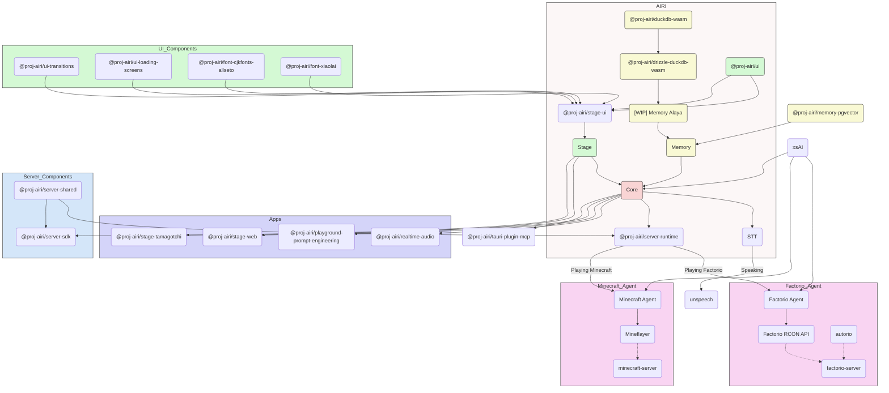

<picture>
  <source
    width="100%"
    srcset="./docs/content/public/banner-dark-1280x640.avif"
    media="(prefers-color-scheme: dark)"
  />
  <source
    width="100%"
    srcset="./docs/content/public/banner-light-1280x640.avif"
    media="(prefers-color-scheme: light), (prefers-color-scheme: no-preference)"
  />
  
</picture>

<h1 align="center">Project AIRI</h1>

<p align="center">模型驅動的靈魂容器，什麼都能做一點的桌寵：讓 Neuro-sama 這樣的虛擬伴侶也成為我們世界中的一份子吧！</p>

<p align="center">
  [<a href="https://discord.gg/TgQ3Cu2F7A">加入 Discord</a>] [<a href="https://airi.moeru.ai">試試看</a>] [<a href="https://github.com/moeru-ai/airi/blob/main/README.md">English</a>] [<a href="https://github.com/moeru-ai/airi/blob/main/docs/README.zh-CN.md">简体中文</a>] [<a href="https://github.com/moeru-ai/airi/blob/main/docs/README.ja-JP.md">日本語</a>]
</p>

<p align="center">
  <a href="https://deepwiki.com/moeru-ai/airi"></a>
  <a href="https://github.com/moeru-ai/airi/blob/main/LICENSE"></a>
  <a href="https://discord.gg/TgQ3Cu2F7A"></a>
  <a href="https://x.com/proj_airi"></a>
  <a href="https://t.me/+7M_ZKO3zUHFlOThh"></a>
</p>

<p align="center">
  <a href="https://www.producthunt.com/products/airi?embed=true&utm_source=badge-featured&utm_medium=badge&utm_source=badge-airi" target="_blank"></a>
  <a href="https://trendshift.io/repositories/14636" target="_blank"></a>
</p>

> 深受 [Neuro-sama](https://www.youtube.com/@Neurosama) 啟發

> [!WARNING]
> **注意：**
> 我們**沒有發行任何**與本項目關聯的加密貨幣或代幣，請注意判斷資訊並謹慎行事。

> [!NOTE]
>
> 我們有一個專門的組織 [@proj-airi](https://github.com/proj-airi) 用於所有從 Project AIRI 誕生的子項目，快來看看吧！
>
> RAG（檢索增強生成）、記憶系統、嵌入式資料庫、圖標、Live2D 實用工具等等！

## 你是否夢想過擁有一個賽博生命（網路老婆/老公、數字桌寵），或者能與你玩耍和交談的 AI 伴侶？

藉助現代大型語言模型的力量，像是 [ChatGPT](https://chatgpt.com) 和著名的 [Claude](https://claude.ai) 所能帶來的，想要 LLM（大語言模型）和我們角色扮演、聊天已經超簡單了，每個人都能上手。而像 [Character.ai（又稱 c.ai）](https://character.ai) 和 [JanitorAI](https://janitorai.com/) 這樣的平台，以及本地應用如 [SillyTavern（又稱酒館）](https://github.com/SillyTavern/SillyTavern)，已經是基於聊天或文字冒險遊戲體驗的相當不錯的解決方案。

> 但是，如何賦予它們玩遊戲的能力呢？讓它們能看到你正在編寫的代碼？不僅能一邊聊天一邊玩遊戲，也可以看視頻，還能做很多其他事情？

你可能已經知道 [Neuro-sama](https://www.youtube.com/@Neurosama)，她目前是最好的能夠玩遊戲、聊天並與你和參與者（在VTuber社區中）互動的 AI VTuber / 伴侶，有些人也稱這種存在為"數字人"。**可惜的是，她並不開源，當她從直播中下線後，你就無法與她互動了**。

因此，這個項目 AIRI，在這裡提供了另一種可能性：**讓你輕鬆擁有自己的數字生命、賽博生命，隨時隨地**。

## 這個項目有什麼特別的呢？

與其他 AI 和 LLM 驅動的 VTuber 開源項目不同，アイリ VTuber 從開始開發的第一天開始就支援多種 Web 技術，涵蓋諸如 [WebGPU](https://www.w3.org/TR/webgpu/)、[WebAudio](https://developer.mozilla.org/en-US/docs/Web/API/Web_Audio_API)、[Web Workers](https://developer.mozilla.org/en-US/docs/Web/API/Web_Workers_API/Using_web_workers)、[WebAssembly](https://webassembly.org/)、[WebSocket](https://developer.mozilla.org/en-US/docs/Web/API/WebSocket) 等已經廣泛應用或仍在大量實驗的 API。

> [!TIP]
> 擔心使用 Web 相關技術會導致性能下降？
>
> 不用擔心，雖然 Web 瀏覽器版本旨在展示我們能在瀏覽器和 WebView 中做到什麼程度，以及我們能推進到什麼程度，但我們絕不會完全依賴這一點。AIRI 的桌面版本預設就能使用原生的 [NVIDIA CUDA](https://developer.nvidia.com/cuda-toolkit) 和 [Apple Metal](https://developer.apple.com/metal/)（感謝 HuggingFace 和深受喜愛的 [candle](https://github.com/huggingface/candle) 項目），無需複雜的依賴管理。考慮到權衡因素，我們部分採用了 Web 技術來處理圖形、佈局、動畫，以及正在開發中的插件系統，讓每個人都能整合自己想要的功能。

這意味著 **アイリ VTuber 能夠在現代瀏覽器和設備上運行**，甚至能夠在行動設備上運行（已經完成了 PWA 支援），這為我們（貢獻者們）帶來了更多的可能性，讓我們得以更進一步構建和擴展 アイリ VTuber 的外部功能，而與此同時也不失配置的靈活性——可以有選擇地在不同設備上啟用會需要 TCP 連接或其他非 Web 技術的功能，例如連接到 Discord 的語音頻道一起開黑，或是和朋友們一起玩 Minecraft（我的世界）、Factorio（異星工廠）。

> [!NOTE]
>
> アイリ VTuber 仍處於早期開發階段，我們歡迎優秀的開發者加入我們，一起將它變為現實。
>
> 即使不熟悉 Vue.js、TypeScript 和所需的其他開發工具也沒關係，我們也歡迎藝術家、設計師、營運策劃的加入，你甚至可以成為第一個用 アイリ VTuber 直播的博主。
>
> 如果你使用的是 React、 Svelte，甚至 Solid 也沒關係，您可以自己創建一個子目錄，添加您希望在 アイリ VTuber 中看到的功能，或者想實驗的功能。
>
> 我們非常期待以下領域的朋友加入：
>
> - Live2D 模型師
> - VRM 模型師
> - VRChat 模型設計師
> - 計算機視覺（CV）
> - 強化學習（RL）
> - 語音識別
> - 語音合成
> - ONNX 推理運行時
> - Transformers.js
> - vLLM
> - WebGPU
> - Three.js
> - WebXR (也可以看看我們在 @moeru-ai 組織下另外的[這個項目](https://github.com/moeru-ai/chat))
>
> **如果你已經感興趣了，為什麼不來這裡和大家打個招呼呢？[Would like to join part of us to build AIRI?](https://github.com/moeru-ai/airi/discussions/33)**

## 當前進度


- [x] 思維能力
  - [x] 玩 [Minecraft](https://www.minecraft.net)
  - [x] 玩 [Factorio](https://www.factorio.com)
  - [x] 在 [Telegram](https://telegram.org) 聊天
  - [x] 在 [Discord](https://discord.com) 聊天
  - [ ] 記憶
    - [x] 純瀏覽器內資料庫支援（基於 DuckDB WASM 或者 `pglite`）
    - [ ] Alaya 記憶層（施工中）
  - [ ] 純瀏覽器的本地推理（基於 WebGPU）
- [x] 語音理解
  - [x] 瀏覽器音訊輸入
  - [x] [Discord](https://discord.com) 音訊輸入
  - [x] 客戶端語音識別
  - [x] 客戶端說話檢測
- [x] 語言能力
  - [x] [ElevenLabs](https://elevenlabs.io/) 語音合成
- [x] 身體動作
  - [x] VRM 支援
    - [x] 控制 VRM 模型
  - [x] VRM 模型動畫
    - [x] 自動眨眼
    - [x] 自動看
    - [x] 空閒眼睛移動
  - [x] Live2D 支援
    - [x] 控制 Live2D 模型
  - [x] Live2D 模型動畫
    - [x] 自動眨眼
    - [x] 自動看
    - [x] 空閒眼睛移動

## 開發

> 有關開發此項目的具體教程，參見 [CONTRIBUTING.md](./.github/CONTRIBUTING.md)

> [!NOTE]
> 預設情況下，`pnpm dev` 將啟動 Stage Web（瀏覽器版本）的開發伺服器，如果您想嘗試開發桌面版本，
> 請確保您閱讀 [CONTRIBUTING.md](./.github/CONTRIBUTING.md) 以正確設定環境。

```shell
pnpm i
pnpm dev
```

### 網頁版 (也就是 [airi.moeru.ai](https://airi.moeru.ai) 的版本)

```shell
pnpm dev
```

### 桌面版（也叫拓麻歌子，aka 電子寵物）

```shell
pnpm dev:tamagotchi
```

### 文件站

```shell
pnpm dev:docs
```

### 發布

請在運行 `bumpp` 後更新 `Cargo.toml` 中的版本：

```shell
npx bumpp --no-commit --no-tag
```

## 原生支援的 LLM API 服務來源列表（由 [xsai](https://github.com/moeru-ai/xsai) 驅動）

- [x] [OpenRouter](https://openrouter.ai/)
- [x] [vLLM](https://github.com/vllm-project/vllm)
- [x] [SGLang](https://github.com/sgl-project/sglang)
- [x] [Ollama](https://github.com/ollama/ollama)
- [x] [Google Gemini](https://developers.generativeai.google)
- [x] [OpenAI](https://platform.openai.com/docs/guides/gpt/chat-completions-api)
  - [ ] [Azure OpenAI API](https://learn.microsoft.com/en-us/azure/ai-services/openai/reference)
- [x] [Anthropic Claude](https://anthropic.com)
  - [ ] [AWS Claude](https://learn.microsoft.com/en-us/azure/ai-services/openai/reference)
- [x] [深度求索 DeepSeek](https://www.deepseek.com/)
- [x] [通義千問 Qwen](https://help.aliyun.com/document_detail/2400395.html)
- [x] [xAI](https://x.ai/)
- [x] [Groq](https://wow.groq.com/)
- [x] [Mistral](https://mistral.ai/)
- [x] [Cloudflare Workers AI](https://developers.cloudflare.com/workers-ai/)
- [x] [Together.ai](https://www.together.ai/)
- [x] [Fireworks.ai](https://www.together.ai/)
- [x] [Novita](https://www.novita.ai/)
- [x] [智譜](https://bigmodel.cn)
- [x] [矽基流動](https://cloud.siliconflow.cn/i/rKXmRobW)
- [x] [階躍星辰](https://platform.stepfun.com/)
- [x] [百川](https://platform.baichuan-ai.com)
- [x] [Minimax](https://api.minimax.chat/)
- [x] [月之暗面](https://platform.moonshot.cn/)
- [x] [Player2](https://player2.game/)
- [x] [騰訊混元](https://cloud.tencent.com/document/product/1729)
- [ ] [訊飛星火](https://www.xfyun.cn/doc/spark/Web.html)
- [ ] [火山引擎（豆包）](https://www.volcengine.com/experience/ark?utm_term=202502dsinvite&ac=DSASUQY5&rc=2QXCA1VI)

## 從這個項目誕生的子項目

- [Awesome AI VTuber](https://github.com/proj-airi/awesome-ai-vtuber): AI VTuber 和相關項目的精選列表
- [`unspeech`](https://github.com/moeru-ai/unspeech): 用於代理 `/audio/transcriptions` 和 `/audio/speech` 的代理伺服器實現，類似 LiteLLM 但面向任何 ASR 和 TTS
- [`hfup`](https://github.com/moeru-ai/hfup): 幫助部署、打包到 HuggingFace Spaces 的工具集
- [`xsai-transformers`](https://github.com/moeru-ai/xsai-transformers): 實驗性 [🤗 Transformers.js](https://github.com/huggingface/transformers.js) 提供者，用於 [xsAI](https://github.com/moeru-ai/xsai)。
- [WebAI: Realtime Voice Chat](https://github.com/proj-airi/webai-realtime-voice-chat): 從頭開始實現 ChatGPT 即時語音的完整範例，包含 VAD + STT + LLM + TTS。
- [`@proj-airi/drizzle-duckdb-wasm`](https://github.com/moeru-ai/airi/tree/main/packages/drizzle-duckdb-wasm/README.md): DuckDB WASM 的 Drizzle ORM driver 驅動
- [`@proj-airi/duckdb-wasm`](https://github.com/moeru-ai/airi/tree/main/packages/duckdb-wasm/README.md): 易於使用的 `@duckdb/duckdb-wasm` 封裝
- [`tauri-plugin-mcp`](https://github.com/moeru-ai/airi/blob/main/crates/tauri-plugin-mcp/README.md): 用於與 MCP 伺服器互動的 Tauri 插件。
- [AIRI Factorio](https://github.com/moeru-ai/airi-factorio): 讓 AIRI 玩 Factorio
- [Factorio RCON API](https://github.com/nekomeowww/factorio-rcon-api): Factorio 無頭伺服器控制台的 RESTful API 封裝
- [`autorio`](https://github.com/moeru-ai/airi-factorio/tree/main/packages/autorio): Factorio 自動化庫
- [`tstl-plugin-reload-factorio-mod`](https://github.com/moeru-ai/airi-factorio/tree/main/packages/tstl-plugin-reload-factorio-mod): 開發時支援熱重載 Factorio 模組
- [Velin](https://github.com/luoling8192/velin): 用 Vue SFC 和 Markdown 文件來為 LLM 書寫簡單好用的提示詞
- [`demodel`](https://github.com/moeru-ai/demodel): 輕鬆加速各種推理引擎和模型下載器拉/下載模型或數據集的速度
- [`inventory`](https://github.com/moeru-ai/inventory): 中心化模型目錄和預設服務來源配置的公開 API 服務
- [MCP Launcher](https://github.com/moeru-ai/mcp-launcher): 易於使用的 MCP 啟動器，適用於所有可能的 MCP Server，就像用於模型推理的 Ollama 一樣！
- [🥺 SAD](https://github.com/moeru-ai/sad): 自託管和瀏覽器運行 LLM 的文件和說明



## 同類項目

### 開源項目

- [kimjammer/Neuro: A recreation of Neuro-Sama originally created in 7 days.](https://github.com/kimjammer/Neuro)：非常完善的 Neuro-Sama 實現
- [SugarcaneDefender/z-waif](https://github.com/SugarcaneDefender/z-waif)：以遊戲、自主代理和提示詞工程見長
- [semperai/amica](https://github.com/semperai/amica/)：適配 VRM, WebXR
- [elizaOS/eliza](https://github.com/elizaOS/eliza)：將 AI 智能體集成至各類系統和 API 中的一個軟體工程實踐
- [ardha27/AI-Waifu-Vtuber](https://github.com/ardha27/AI-Waifu-Vtuber)：Twitch API 集成
- [InsanityLabs/AIVTuber](https://github.com/InsanityLabs/AIVTuber)：優秀的 UI/UX 設計
- [IRedDragonICY/vixevia](https://github.com/IRedDragonICY/vixevia)
- [t41372/Open-LLM-VTuber](https://github.com/t41372/Open-LLM-VTuber)
- [PeterH0323/Streamer-Sales](https://github.com/PeterH0323/Streamer-Sales)

### 非開源項目

- https://clips.twitch.tv/WanderingCaringDeerDxCat-Qt55xtiGDSoNmDDr https://www.youtube.com/watch?v=8Giv5mupJNE
- https://clips.twitch.tv/TriangularAthleticBunnySoonerLater-SXpBk1dFso21VcWD
- https://www.youtube.com/@NOWA_Mirai

## 項目狀態


## 鳴謝

- [Reka UI](https://github.com/unovue/reka-ui): 的文件頁面設計，新的著陸頁基本上是在他們完成的工作至上發揮得來的，也感謝他們實現了大量的 UI 組件。（shadcn-vue 使用 Reka UI 作為 headless 組件，也請記得去看看！）
- [pixiv/ChatVRM](https://github.com/pixiv/ChatVRM)
- [josephrocca/ChatVRM-js: A JS conversion/adaptation of parts of the ChatVRM (TypeScript) code for standalone use in OpenCharacters and elsewhere](https://github.com/josephrocca/ChatVRM-js)
- UI 和樣式的設計受 [Cookard](https://store.steampowered.com/app/2919650/Cookard/)，[UNBEATABLE](https://store.steampowered.com/app/2240620/UNBEATABLE/)，以及 [Sensei! I like you so much!](https://store.steampowered.com/app/2957700/_/)，還有 [Ayame by Mercedes Bazan](https://dribbble.com/shots/22157656-Ayame) 和 [Wish by Mercedes Bazan](https://dribbble.com/shots/24501019-Wish) 的作品啟發
- [mallorbc/whisper_mic](https://github.com/mallorbc/whisper_mic)
- [`xsai`](https://github.com/moeru-ai/xsai)：實現了相當數量的包來與 LLM 和模型交互，像 [Vercel AI SDK](https://sdk.vercel.ai/) 但是更小

## Star History

[](https://www.star-history.com/#moeru-ai/airi&Date)
